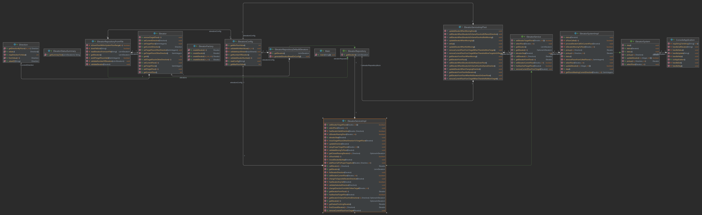

# Elevator System Simulation <br>(Symulacja Systemu Wind)

## Wprowadzenie
Ten projekt symuluje system kontroli wind w budynku. Jest w stanie on obsłużyć wiele wind w tym samym czasie dla budynku 
który może mieć rownież piętra podziemne (poziom poniżej 0). Można konfigurować podstawowe informacje o windach 
takie jak ich ilość, a także definiować stan podczątkowy dla każdej z wind.

## Spis treści
1. [Wprowadzenie](#wprowadzenie)
2. [Instalacja](#instalacja)
3. [Uruchomienie aplikacji](#uruchomienie-aplikacji)
4. [Funkcje](#funkcje)
5. [Zależności](#zależności)
6. [Konfiguracja](#konfiguracja)
7. [Algorytm wyboru windy](#algorytm-wyboru-windy)
8. [Problem wybierania piętra po przyjeździe windy](#problem-wybierania-piętra-po-przyjeździe-windy)
9. [Używanie aplikacji](#używanie-aplikacji)
10. [Diagram klas](#diagram-klas)
11. [Przykłady przypadków brzegowych](#przykłady-przypadków-brzegowych)
12. [Autor](#autor)

## Instalacja
Aby zainstalować i uruchomić ten projekt, wykonaj następujące kroki:
1. Sklonuj repozytorium:
    ```bash
    git clone https://github.com/domstach00/ElevatorSystemSimulation.git
    ```
2. Przejdź do katalogu projektu:
    ```bash
    cd ElevatorSystemSimulation
    ```
3. Zbuduj projekt za pomocą Maven:
    ```bash
    mvn clean install
    ```

## Uruchomienie aplikacji
Aby uruchomić symulację, wykonaj następujące polecenie:
```bash
java -jar .\target\ElevatorSystemSimulation-1.0-jar-with-dependencies.jar
```

## Funkcje
- Zarządzanie wieloma windami
- Aktualizacje statusu w czasie rzeczywistym
- Konfigurowalne parametry
- Konfigurowalny początkowy stan wind

## Zależności
- Java 17
- Maven 3.9.8 lub nowszy

## Konfiguracja
### Podstawowa konfiguracja systemu
Opcje konfiguracji można zmieniać w pliku `src/main/resources/config/elevators.properties`. Oto kilka powszechnych ustawień:
- `numberOfElevators`: Liczba wind w systemie
- `minFloorValue`: Najniższy numer piętra
- `maxFloorValue`: Najwyższy numer piętra

### Predefiniowany początkowy stan wind
Początkowy stan wind można zmienić w pliku `src/main/resources/elevators/elevators.json`. Oto szablon tego pliku:
```json
[
   {
      "id": "<Integer>",
      "currentFloor": "<Integer>",
      "currentDirection": "<UP | IDLE | DOWN>",
      "targetFloors": ["<Integer>"],
      "targetFloorsOtherDirection": ["<Integer>"]
   }
]
```

## Algorytm wyboru windy
Algorytm wyboru windy jest odpowiedzialny za wybór najbardziej odpowiedniej windy do obsługi żądania użytkownika. Proces przebiega następująco:
1. **Walidacja piętra**: Algorytm sprawdza, czy żądane piętro znajduje się w zakresie dozwolonych pięter.
2. **Znajdowanie najbliższej windy**: W klasie `ElevatorServiceImpl` metoda `findClosestElevator` jest używana do znalezienia najbliższej windy, która może obsłużyć żądanie. Uwzględnia to bieżącą pozycję wind oraz kierunek ich ruchu.
    1. Na początku algorytm szuka windy, która znajduje się na tym samym piętrze i nie porusza się, lub jedzie w tym samym kierunku.
    2. Jeśli nie ma takiej windy, algorytm szuka windy, która przejeżdża przez piętro, na którym znajduje się użytkownik, i porusza się w tym samym kierunku.
    3. W ostatnim przypadku, gdy żadna winda nie przejeżdża przez piętro użytkownika, wybierana jest winda z najmniejszą liczbą aktywnych połączeń.
3. **Dodanie żądania piętra do listy celów windy**: Gdy najbliższa winda zostanie zidentyfikowana, piętro, na którym użytkownik wezwał windę, zostaje dodane do odpowiedniej listy celów tej windy.
4. **Zmiana kierunku windy, jeśli jest bezczynna**: Jeśli wybrana winda jest obecnie bezczynna, jej kierunek jest zmieniany na nowy cel.

## Problem wybierania piętra po przyjeździe windy
Aby rozwiązać problem wyboru piętra przez użytkownika po wejściu do windy zdecydowałem się na użycie struktury `Set<Integer, Set<Integer>>` (W klasie `ElevatorSystemImpl`).
- Wartość klucz oznacza numer piętra skąd była wzywana winda.
- Lista wartości oznacza piętra na która użytkownik/użytkownicy chcą się dostać.

Algorytm obsługujący powyższy problem działa w następujący sposób:
- Do powyższej struktóry dodawane są tylko wezwania w których użytkownik zdefiniuje piętro na które chce jechać.
- Jeżeli winda znajduje się na piętrze z wartości klucza, wtedy tylko wartości które pasują do kierunku windy są dodawane do `targetFloors`
  - Reszta użytkowników czeka na kolejną windę
- Użyte wartości są usuwane z pierwotnej struktury  

## Używanie aplikacji
Gdy aplikacja jest uruchomiona, dostępne są następujące **polecenia**:
- `help` - wyświetla dostępne polecenia.
- `exit` - zatrzymuje aplikację.
- `step` - wykonuje krok w symulacji. Status jest wyświetlany po każdym kroku.
- `status` - wyświetla statusy wind.
- `update <id> <updatedCurrentFloor?> <updatedTargetFloors?>` - aktualizuje windę o danym id.
- `call <floorNumber> <direction> <desiredFloor?>` - wywołuje windę na danym piętrze, aby poruszała się w określonym kierunku (`1 == UP` i `-1 == DOWN`). DesiredFloor to numer piętra, na które chce udać się użytkownik.

<br>Symbol `?` oznacza, że dany argument jest opcjonalny. Można przekazać `null` lub pominąć argument, jeśli jest on ostatnim argumentem.

## Diagram klas


## Przykłady przypadków brzegowych
Testy które reprezentują przypadki brzegowe można znaleźć w katalogu `src/test/java`.

# Autor
- Dominik Stachowiak
